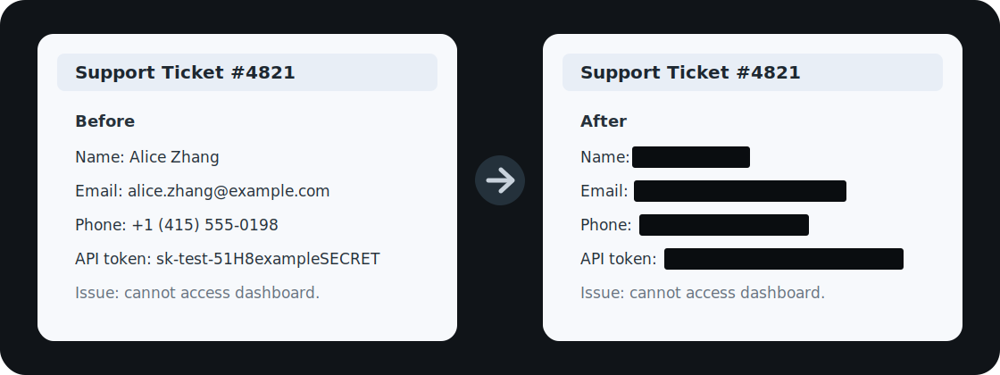

# safeclipper



safeclipper is a local-first image redaction tool for screenshots and agent workflows. It OCRs an image, detects sensitive text with OpenAI Privacy Filter q4 ONNX weights, and masks the matching image regions before the image leaves the user's machine.

## Why

Proactive agents increasingly need screen context: screenshots, browser pages, app windows, documents, support tickets, dashboards, and other user data. That context is useful, but it can also contain names, emails, phone numbers, addresses, API keys, account numbers, student IDs, customer records, and other private information.

safeclipper exists to put a local privacy layer in front of those workflows. The intended use is simple:

1. Capture or receive a screenshot locally.
2. Run OCR and sensitive-span detection on-device.
3. Produce a redacted image with private regions masked.
4. Send only the redacted image to a proactive agent, cloud model, support workflow, or evaluation pipeline.

The goal is not to replace agent memory or permission systems. The goal is to reduce accidental data collection by making local screenshot sanitization cheap, repeatable, and available as both a CLI and a native macOS app.

## Repository Layout

- `crates/safeclipper-cli/`: Rust CLI. Text redaction is cross-platform. Image OCR/redaction supports Apple Vision and Tesseract on macOS, and Tesseract on non-macOS platforms.
- `apps/macos/SafeClipper/`: native SwiftUI macOS app. It links the Rust library for OCR, privacy detection, and image redaction.
- `models/`: model download scripts and ignored local model cache.
- `fixtures/`: small local test images.
- `eval/`: OCR/evaluation artifacts from dataset experiments.

There is no `privacy-filter` submodule. The CLI and the macOS app's linked Rust library consume the public Hugging Face ONNX artifacts directly.

## Benchmark

Measured on May 25, 2026 with a release build on an Apple M3 Max, 64 GB memory, macOS 26.5, and `model_q4_embedded.onnx`.

`wall time` is the end-to-end CLI process time, including process startup, tokenizer/model loading, OCR when present, inference, decoding, image masking, and output serialization. `model time` is the CLI-reported privacy-model inference path latency from the JSON summary, excluding model load and OCR.

| Use case | Input | Provider | Spans | Warm wall time | Model time |
| --- | --- | --- | --- | ---: | ---: |
| Short text redaction | `Alice Smith email alice@example.com` | CPU | 2 | ~0.65 s | ~70 ms |
| Support-ticket text | 255 chars with name, email, phone, address, API token | CPU | 8 | ~1.04 s | ~423 ms |
| Screenshot redaction | `fixtures/privacy-screenshot.png` with Vision OCR | CPU | 8 | ~1.39 s | ~419 ms |

## Setup

Download the q4 model files:

```bash
./models/download-openai-privacy-filter-q4.sh
```

Build the Rust CLI and dylib:

```bash
cargo +1.88.0 build --release -p safeclipper-cli
```

Run text detection:

```bash
./target/release/safeclipper \
  --provider cpu \
  --model models/openai-privacy-filter/onnx/model_q4_embedded.onnx \
  --tokenizer models/openai-privacy-filter/tokenizer.json \
  --config models/openai-privacy-filter/config.json \
  --text "Alice Smith email alice@example.com"
```

Output only the redacted text:

```bash
./target/release/safeclipper \
  --provider cpu \
  --model models/openai-privacy-filter/onnx/model_q4_embedded.onnx \
  --tokenizer models/openai-privacy-filter/tokenizer.json \
  --config models/openai-privacy-filter/config.json \
  --text "Alice Smith email alice@example.com" \
  --output text
```

Redact an image directly from the CLI on macOS:

```bash
./target/release/safeclipper \
  --provider cpu \
  --model models/openai-privacy-filter/onnx/model_q4_embedded.onnx \
  --tokenizer models/openai-privacy-filter/tokenizer.json \
  --config models/openai-privacy-filter/config.json \
  --image fixtures/privacy-screenshot.png \
  --output-image /tmp/privacy-screenshot-redacted.png
```

For image input, the Rust CLI runs OCR, feeds the OCR text into the same ONNX privacy model, maps detected spans back to OCR token boxes, and writes a redacted PNG/JPEG with black masks.

OCR backends:

- `--ocr-backend auto`: default. Uses Apple Vision on macOS and Tesseract elsewhere.
- `--ocr-backend vision`: macOS only. Calls Apple Vision through a small native bridge.
- `--ocr-backend tesseract`: uses the `tesseract` command-line binary on macOS, Linux, or Windows.

Tesseract options:

```bash
./target/release/safeclipper \
  --provider cpu \
  --model models/openai-privacy-filter/onnx/model_q4_embedded.onnx \
  --tokenizer models/openai-privacy-filter/tokenizer.json \
  --config models/openai-privacy-filter/config.json \
  --image fixtures/privacy-screenshot.png \
  --output-image /tmp/privacy-screenshot-redacted.png \
  --ocr-backend tesseract \
  --tesseract-bin tesseract \
  --tesseract-lang eng \
  --tesseract-psm 6
```

Build and run the macOS app:

```bash
cd apps/macos/SafeClipper
./build-app.sh debug
open build/safeclipper.app
```
