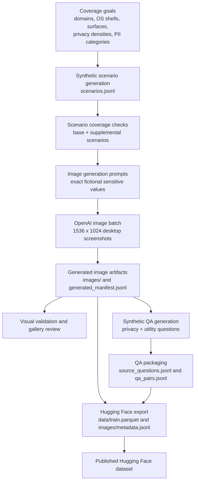
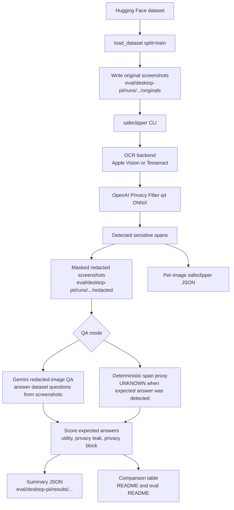

# Desktop PII Evaluation

This folder benchmarks safeclipper on the Hugging Face dataset
`JettChenT/desktop-pii-210`.

The runner downloads the dataset with `datasets.load_dataset`, writes each
screenshot to a local run directory, invokes the release `safeclipper` CLI on the
image, keeps the generated redacted images under `eval/desktop-pii/runs/`, and
writes a compact summary to `eval/desktop-pii/results/`.

## Results

Run date: May 25, 2026.

All rows use Gemini redacted-image QA over the same 210 synthetic desktop
screenshots and the same calibrated 2,717-question subset.

| Redactor | QA questions | Utility score | Privacy block rate | Privacy leak rate | Overall |
| --- | ---: | ---: | ---: | ---: | ---: |
| WebRedact large | 2,717 | 0.6412 | 0.5761 | 0.4239 | 0.6087 |
| ScreenPipe PII image redactor | 2,717 | 0.9043 | 0.2395 | 0.7605 | 0.5719 |
| Gemini 3 Flash preview redaction | 2,717 | 0.9681 | 0.7647 | 0.2353 | 0.8664 |
| safeclipper q4 + OCR | 2,717 | 0.9152 | 0.7039 | 0.2961 | 0.8095 |

safeclipper run details:

- Calibrated subset: 1,176 correct and 15 partial out of 1,285 utility
  questions; 424 leaks out of 1,432 privacy questions.
- Full packaged QA set: utility score 0.9135, privacy block rate 0.7036,
  privacy leak rate 0.2964, overall 0.8085 across 2,760 questions.
- Redaction output: 9,226 masks total, 43.9 masks per image on average.
- Latency: mean safeclipper wall time 2.23s/image; mean model-only time
  1.01s/image; mean Gemini answer time 7.47s/image with concurrency 20.

The full safeclipper JSON summary is written to
`eval/desktop-pii/results/safeclipper-desktop-pii-210-summary.json`.

## Run

From the repository root:

Python dependencies are declared in `eval/pyproject.toml`; `uv --project eval`
will create or reuse the eval environment.

```bash
./models/download-openai-privacy-filter-q4.sh
cargo +1.88.0 build --release -p safeclipper-cli

uv --project eval run python \
  eval/desktop-pii/run_eval.py --qa-mode deterministic
```

For the Gemini redacted-image QA path, copy an `.env` with `OPENROUTER_API_KEY`
or `OPENAI_API_KEY` into the repository root first. Also set an
OpenAI-compatible endpoint with `OPENROUTER_BASE_URL`, `OPENAI_BASE_URL`,
`LLM_BASE_URL`, or `--llm-base-url`.

```bash
uv --project eval run python \
  eval/desktop-pii/run_eval.py --qa-mode gemini --resume
```

For a quick smoke test:

```bash
uv --project eval run python \
  eval/desktop-pii/run_eval.py --limit 5 --qa-mode gemini --resume
```

The default full run uses:

- Dataset: `JettChenT/desktop-pii-210`, split `train`
- Model: `models/openai-privacy-filter/onnx/model_q4_embedded.onnx`
- CLI: `target/release/safeclipper`
- Provider: `cpu`
- OCR: `auto`, which uses Apple Vision on macOS and Tesseract elsewhere
- QA scorer: Gemini 3 Flash preview over safeclipper-redacted screenshots

Generated originals, redactions, per-image JSON, and per-question predictions
are intentionally ignored by git under `eval/desktop-pii/runs/`.

## Benchmark Design

`desktop-pii-210` contains 210 synthetic desktop screenshots at 1536 x 1024.
The scenes cover developer ops, healthcare, legal, finance, education,
government, insurance, logistics, real estate, tax, travel, and utilities.
The dataset has 2,760 QA pairs: 1,454 privacy questions and 1,306 utility
questions.

The data-generation pipeline in `image-redaction-research` has two stages:

1. Synthetic image specifications are generated across domains, OS shells,
   surfaces, layouts, privacy densities, and sensitive-value categories. Each
   scenario asks the image generator to render fictional but exact sensitive
   strings such as names, emails, dates of birth, credentials, internal tickets,
   hostnames, private links, record notes, account IDs, and financial values.
2. Synthetic QA pairs are generated from the screenshots. Privacy questions ask
   for values that should be hidden after redaction. Utility questions ask for
   non-sensitive values that should remain answerable after redaction.



The full upstream benchmark applies each redactor's bounding boxes to the
screenshots, asks Gemini to answer every calibrated QA question from the
redacted images, and scores the answers with a judge. A good redactor has high
privacy block rate and high utility score.

This safeclipper runner supports the same redacted-image QA shape:

- safeclipper OCRs each screenshot, runs the q4 OpenAI Privacy Filter ONNX model,
  and writes a redacted image.
- Gemini answers the dataset's existing privacy and utility questions from the
  safeclipper-redacted image.
- The deterministic dataset scorer compares Gemini's answers to expected
  answers. Privacy questions count as leaks if Gemini still returns the expected
  sensitive value. Utility questions count as correct when Gemini can still
  answer the non-sensitive value.



For local iteration without LLM calls, `--qa-mode deterministic` uses a cheaper
span proxy:

- If safeclipper detects the expected answer text, the prediction is `UNKNOWN`.
- If safeclipper does not detect the expected answer text, the prediction is the
  expected answer.
- Privacy score rewards `UNKNOWN` for privacy questions.
- Utility score rewards preserving utility answers instead of masking them.
- Overall score is `0.5 * utility_score + 0.5 * privacy_block_rate`.

The deterministic mode is only a visibility proxy for the full Gemini VQA
benchmark. It is useful for local iteration because it does not require an LLM
API key, but it does not measure whether a VQA model could still infer an answer
from nearby context.
